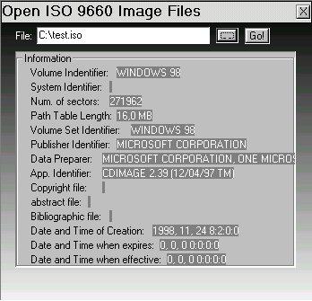



## Read ISO9660 images \(normal CD\-ROM images\)

### Description

This article will show you, how to read the main informations of a ISO9660 image.
 
### More Info
 

             |
---                |---
**Submitted On**   |2001-07-23 16:27:04
**By**             |[actorics\.de](https://github.com/Planet-Source-Code/PSCIndex/blob/master/ByAuthor/actorics-de.md)
**Level**          |Intermediate
**User Rating**    |4.9 (39 globes from 8 users)
**Compatibility**  |VB 6\.0
**Category**       |[Complete Applications](https://github.com/Planet-Source-Code/PSCIndex/blob/master/ByCategory/complete-applications__1-27.md)
**World**          |[Visual Basic](https://github.com/Planet-Source-Code/PSCIndex/blob/master/ByWorld/visual-basic.md)
**Archive File**   |[Read\_ISO96152144112003\.zip](https://github.com/Planet-Source-Code/actorics-de-read-iso9660-images-normal-cd-rom-images__1-42054/archive/master.zip)

### Source Code

<h1>Hi! Welcome to this little tutorial!</h1>

It will show you how to read the main informations of an ISO9660 Image file. 
First of all, what is an ISO9660 image file? 
ISO9660 is the standard specification for file systems on a CD-ROM. 
An ISO9660 Image is a 1:1 copy of a CD-ROM to a file on your hard drive. 
Mostly the extension is *.iso.  
But there are also other formats like: *.bin, *.img, ... 
I only want to show you how to get informations from a normal image (*.iso) 
because this is a very easy image format.

If you open an image with word or something like this, you will see....nothing. 
That's because the first 16 sectors of a CD-ROM are always empty. 
One sector of a CD-ROM is 2048 bytes big. 
Note: Sometimes VCDs have bigger sectors. 
In this project the sector size is 2048. 
Then comes the header: CD001 
And now it gets interesting. 
The Volume Descriptors are coming!!!! 
The next 32 bytes are the title of the CD-ROM. 
After the title comes the System Descriptor. 
It's also 32 bytes long. 
It describes the system that you need that the CD-ROM works. 
For the next part of the ISO you need to know what an Endian is. 
It's a data format for saving binary data. There are a lot of them in an image. 
The most used in the whole wide world is the big endian, I think. 
An 32 bit endian is always 4 bytes big. 
In the ISO9660 format you need to convert a lot of endians back. 
I added a demo project that reads more information than this article. 
Just look at the screenshot!

